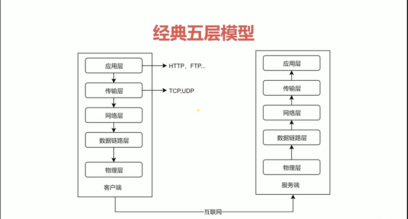

## 浏览器输入 url 后 http 请求返回数据的完整过程

1. 浏览器首先会进行 redirect，因为浏览器可能永久重定向到了另一个网址
2. app cache，因为这次的请求可能已经被浏览器缓存了
3. 没有缓存，则开始 dns 解析（域名 -> ip）
4. 有了 ip 后开始创建 tcp 连接，3 次握手（https 还有个保证安全的过程）
5. tcp 连接创建好了，才能去发送 request 数据包（给服务器）
6. 数据包发送完成，服务器接收到，处理完成后，发送 response 数据包（给浏览器）
7. http 请求真正完成

## 网络协议分层

经典五层模型：

### 底三层

- 物理层：主要作用是定义物理设备如何传输数据（物理连接）
- 数据链路层：在通信实体间建立数据链路的连接（软件连接）
- 网络层：为数据在结点之间传输创建逻辑链路

### 传输层

tcp/ip 协议（主要），udp 协议

向用户提供可靠的端到端服务，建立了本地客户端到远程服务器的协议

传输层向高层屏蔽了下层数据通信的细节

### 应用层

http 协议

为应用软件提供服务，构建于 tcp 协议之上的

屏蔽了网络传输相关细节

## http 协议发展历史

1. http/0.9

   只有一个命令 get

   没有 header 等描述数据的信息

   服务器发送完毕就关闭 tcp 连接

2. http/1.0

   增加了很多命令 put,post...

   增加 status code 和 header

   增加了多字符集支持、多部分发送、权限、缓存

3. http/1.1

   持久连接

   pipeline

   host 和其他命令

4. http2

   说有数据以二进制传输

   同一个连接里发送的请求不再需要按照顺序来

   头信息压缩以及推送等提高效率的功能

## tcp 三次握手

http 只有请求和响应两种模式，是不存在传输通道功能的，这个传输通道由 tcp 协议提供

tcp 连接上可以发送多个 http 请求

早期一次 tcp 连接只能发送一个 http 请求，请求结束，连接就关闭了。http1.1 开始，可以实现 tcp 连接的持久连接，在同一个 tcp 连接上发送多个请求

好处是减少三次握手的消耗

三次握手：

1. 客户端发起一个我要创建连接的数据包的请求 SYN=1,Seq=X

2. 服务端接收到该数据包，表示知道，开启 tcp 的端口，返回数据包 SYN=1,ACK=X+1,Seq=Y

3. 客户端接收到该数据包，知道服务端允许进行 tcp 连接，就发送数据包 ACK=Y+1,Seq=Z，告诉服务端我要发送 http 请求了

> 三次握手的原因：

## http 报文
